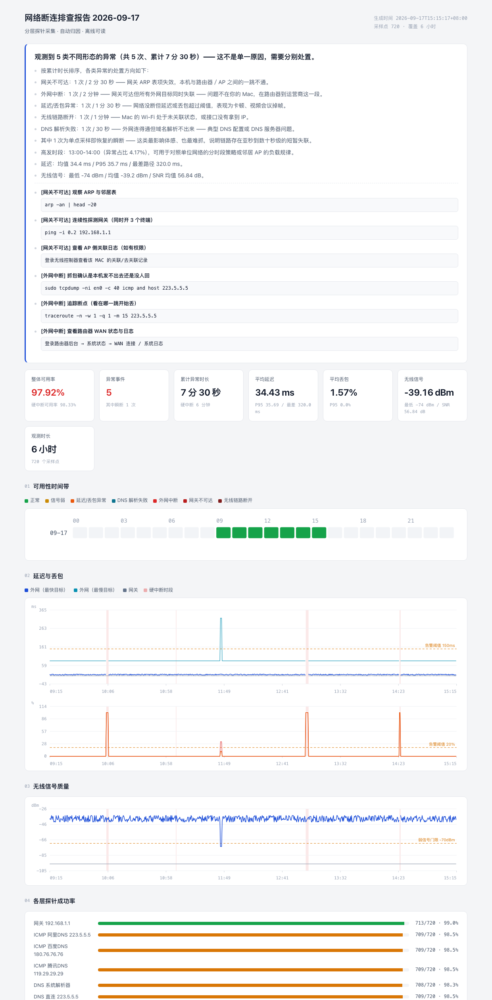

# netmon — macOS 断网定时监控与自动归因

针对"Mac 电脑偶尔断网"这类**间歇性、难复现**问题设计的轻量探针。它不解决断网，它负责在断网发生的那一刻**把现场证据钉下来**，并给出定位结论。



上图为合成样例（`tools/demo_report.py`，覆盖 5 类典型故障），用于预览断网被捕获后的报告形态。可直接打开 [`reports/demo-report.html`](reports/demo-report.html) 查看。

## 为什么是这个方案

排查偶发断连，最大的困难不是"修"，而是"抓不到"。常见的三种做法都不够：

| 做法 | 问题 |
| --- | --- |
| 手动 `ping` 等它断 | 断网随机发生，人不可能一直盯着 |
| 只在网卡上抓包 (tcpdump) | 数据量巨大，且断网时链路层没包就什么都抓不到 |
| 上 Zabbix / Grafana 之类 | 外部监控只能测"到这台机器/从这台机器出去"，测不到 Wi-Fi 关联、ARP、DNS 这些本机视角 |

`netmon` 的取舍：**本机视角 + 分层探针 + 极低开销 + 断网时自动取证**。数据是纯文本 JSONL，断网了也能用 `grep`/`tail` 直接看。

## 判定逻辑

每一轮同时打五层探针（链路 / 网关 / 外网 / DNS / 无线），得到的是"同一时刻"的快照，然后按下面的优先级归因（先命中先定性）：

```
link_down   接口无 IP / Wi-Fi 未关联      → 本机 ↔ AP 这一段
lan_down    网关 ARP 表项失效             → 本机 ↔ 路由器这一段
wan_down    网关在、外网全灭              → 路由器 ↔ 运营商这一段
dns_fail    外网通但解析失败              → DNS 配置 / DNS 服务器
degraded    通但延迟、丢包、抖动超阈值     → 干扰 / 负载
weak_signal 信号强度不足（尚未断）         → 位置 / 信道
ok
```

**关键设计：网关存活用三路信号冗余判定 —— ARP 表项 / ICMP 回显 / TCP RST，任一路成立即视为存活。** 绝大多数路由器默认屏蔽 ICMP echo，如果拿 `ping 网关` 当判据，会得到大量假故障。而连接被 `ConnectionRefused` 拒绝恰恰证明对方 IP 栈是活的，这一点常被误读为失败。三路全灭才判定网关不可达。

**外网判定用加权投票而不是单点 ping。** `1.1.1.1`、`8.8.8.8` 在国内不稳定，配置里通过 `weight` / `actor` 控制，避免"被墙"被误读成"断网"。

## 用法

无需安装、无需依赖，克隆下来即可跑（需要 Python 3.9+，用系统自带的 `/usr/bin/python3` 也行）：

```bash
git clone https://github.com/chris0213/netmon.git && cd netmon

# 1. 先看一眼当前状态（不需要任何前置准备）
python3 -m netmon once

# 2. 试跑一轮，确认采集正常（建议 1-2 分钟）
python3 -m netmon run --duration 120 --interval 10

# 3. 生成 HTML 报告
python3 -m netmon report --open

# 4. 长期监控：装成开机自启的常驻服务
python3 -m netmon install --interval 30
python3 -m netmon status          # 看服务状态
python3 -m netmon uninstall       # 卸载

# 可选：本地实时看板（只在断网排查当天用）
python3 -m netmon serve --port 8899
```

`./netmon.sh` 是等价入口（自动挑一个可用的 python3），嫌敲 `python3 -m` 长可以用它。

`serve` 只监听 `127.0.0.1`，不对外暴露；默认端口 8899，与其他业务端口不冲突。

想看报告长什么样但暂时不想采数据，直接跑合成样例：

```bash
python3 -m tools.demo_report      # 生成 reports/demo-report.html，不写入 data/
```

## 关于采样间隔

| 间隔 | 适用场景 | 每日本地数据量 |
| --- | --- | --- |
| 10 秒 | 故障高发期集中抓捕，能看清秒级瞬断 | 约 4 MB |
| 30 秒 | 长期常驻（默认，推荐） | 约 1.3 MB |
| 60 秒 | 只想统计"每天断几次" | 约 0.7 MB |

单轮开销实测：约 0.3 秒 CPU、2-3 秒墙钟（其中 `system_profiler` 占 1.5 秒，已按 `sample_every_ticks` 降频）。对续航影响可忽略。

## 断网瞬间自动做的三件事

1. **现场快照**：`ifconfig` / `route get default` / `scutil --nwi` / `arp -an` / Wi-Fi 详情，全部按原样存档。
2. **断点追踪**：`traceroute` 到 223.5.5.5，直接看出在哪一跳开始丢包 —— 是本地 AP、单位出口还是运营商。默认 10 分钟冷却，避免事件风暴时刷爆。
3. **无线子系统日志摘要**：`log show --predicate 'subsystem == "com.apple.wifi"'` 中抓 disassoc / deauth / roam 关键字，这是判断"是不是 AP 把你踢了"最硬的证据。

取证记录会挂在报告对应事件行下面，点开即看。

## 配置

`config.json`，改动即生效（常驻服务需重启：`netmon uninstall && netmon install`）。

最常改的三个：

```jsonc
{
  "interval_seconds": 30,           // 采样间隔
  "thresholds": {
    "rtt_warn_ms": 150,             // 延迟告警阈值
    "loss_warn_pct": 20,            // 丢包告警阈值
    "rssi_warn_dbm": -70            // 弱信号阈值
  },
  "icmp_targets": [                 // 想换成单位内网网关/专线地址，改这里
    {"name": "阿里DNS", "host": "223.5.5.5", "weight": 1.0, "actor": true, "tcp_port": 443}
  ]
}
```

`actor: false` 的目标只记录、不参与判定（比如被墙的境外 DNS）。

## 目录结构

```
netmon/
  netmon/            程序本体（纯标准库，无第三方依赖）
    probe.py         五层探针采集
    analyze.py       分层判定 + 事件归并 + 排查知识库
    report.py        单文件离线 HTML 报告（手写内联 SVG 图表）
    forensics.py     断网瞬间取证
    launchd.py       常驻服务安装
  tools/
    demo_report.py   合成数据回归 + 样例报告生成
  config.json        配置
  docs/              README 用截图
  data/              ticks-YYYY-MM-DD.jsonl / evidence-*.jsonl / netmon.log（不入库）
  reports/           生成的 HTML 报告（不入库，仅保留 demo-report.html）
```

## 报告怎么读

先看**结论**卡片（会自动生成主因判断和下一步命令），再看**可用性时间带**（按天 × 小时着色，颜色越深越严重），然后回到**异常事件明细**逐条核对。每个事件下面点开 `<details>` 就是断网那一刻的原始现场。

如果报告显示"未复现故障"，那也是有价值的结论：说明需要拉长观测窗口，并把采样间隔降到 10-15 秒。

## 排查完之后的清理

```bash
python3 -m netmon export --days 7      # 先导出 CSV 留档
python3 -m netmon purge                # 再清空
```

## 已知限制

- 只在 macOS 上验证过（依赖 `system_profiler` / `arp` / `scutil` / `dig`）。Linux 需要替换 Wi-Fi 与网关探测实现。
- Wi-Fi 的 SSID 在新版 macOS 上需要"定位权限"才能读取，未授权时显示为 `<redacted>`，不影响其他指标。
- 工具只能给出**归因方向**，不能替代对路由器/AP 侧日志的核查。

## 环境要求

- macOS（已在 macOS 15 / Apple Silicon 上实测）
- Python 3.9+（系统自带即可，无第三方依赖）
- 可选：`dig`（随系统提供）用于 DNS 探针

## License

[MIT](LICENSE) © 2026 Chris Pan
